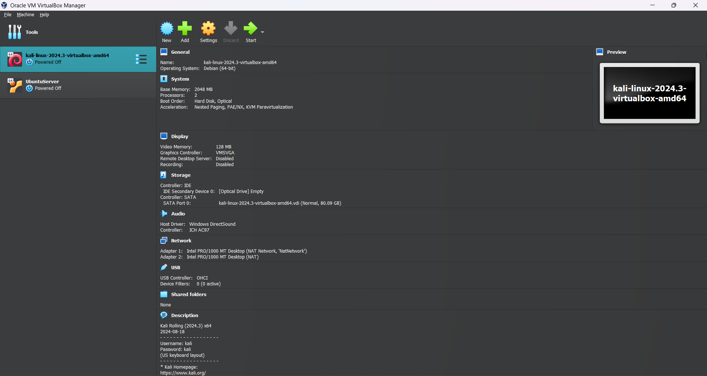
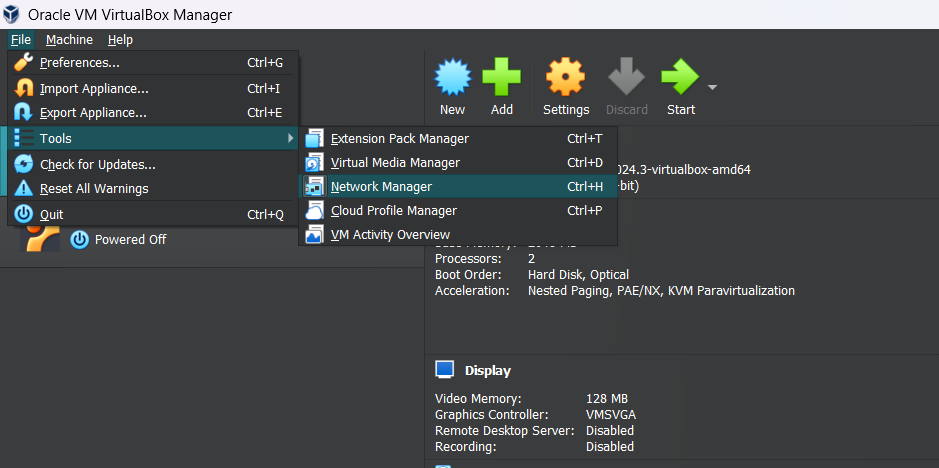
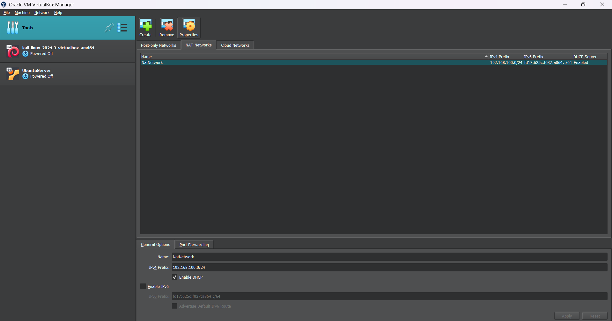
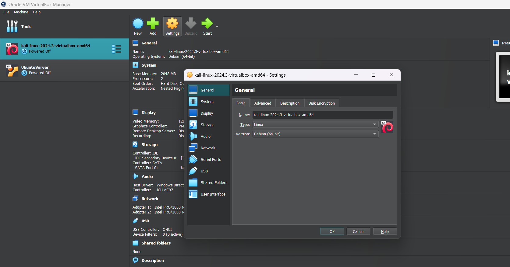
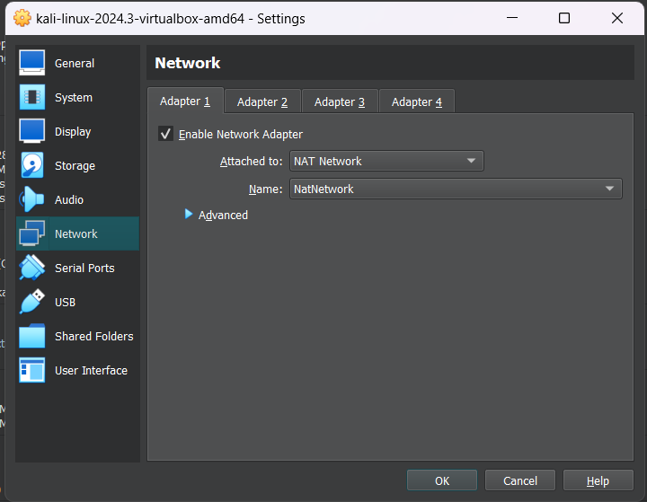
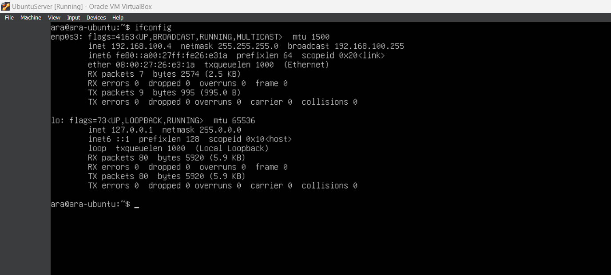
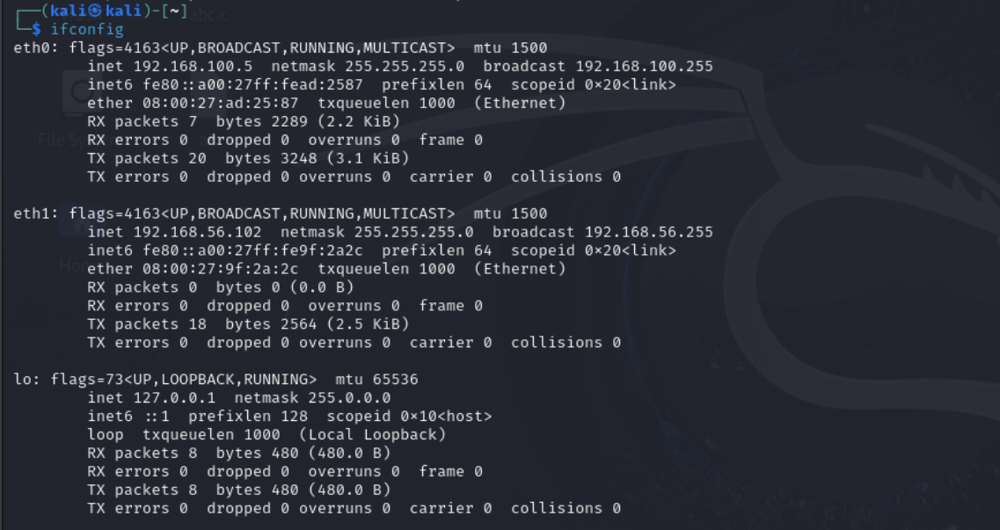
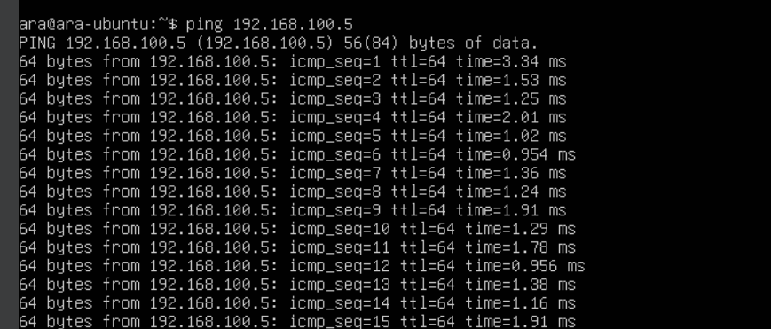
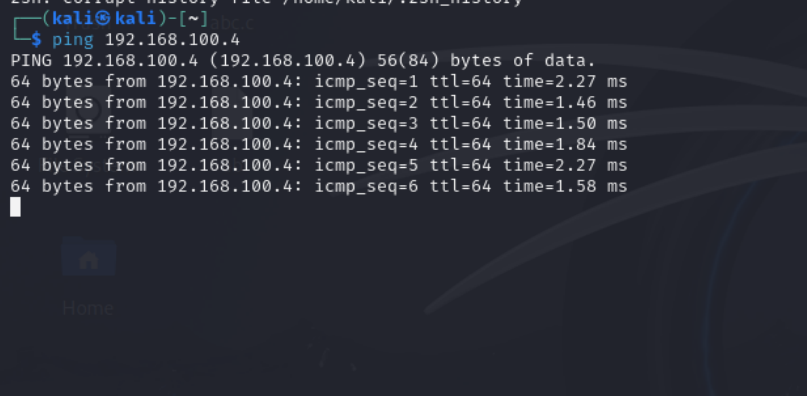

**1.** Open up the `Oracle Virtual Box`
 
**2,** Select `File` -> `Tools` -> `Network Manager`

**3.** Select `Nat Networks`.

**4.** Select `Create` option and on the bottom panel enter your custom ipv4 address like `192.168.100.2/24`

**5.** Click on `Apply` button

**6.** On the vbox, Select `Kali` -> `Settings`

**7.** Now select `Networks` -> `Adapter1` -> `Attached to:` `NAT Network` and the name of Nat network will automatically written 

**8.** Same approach for the ubuntu server and select adapter1 of ubuntu's network setting and voila!

**9.** Run both vms

**10.** Open up the terminal write `ifconfig` you will see the your set ip address

- **Ubuntu Server**

- **Kali Linux**

You can see the the ip address written right after `inet`

Now, if you select different adapters of 2 different machines while configuring the network (at stage 7) then that ip address will be in the `eth1` or in some other `eth` option

**11.** On ubuntu server write ping kali's ip and vice versa
- **Ubuntu Server**

- **Kali Linux**
